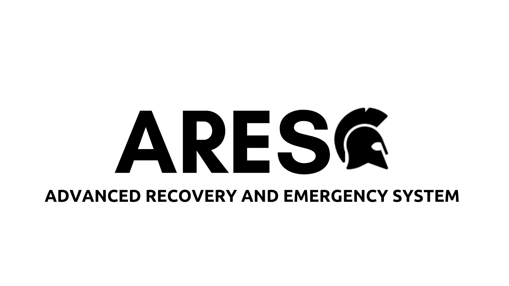

## ATTENTION: The development of the project has been terminated.

## ADVANCED RECOVERY AND EMERGENCY SYSTEM 
>

>  
>  This project is the open source code of the ARES software made by Berat Bayraktar and has been applied for TEKNOFEST** and TÜBİTAK. And in the process of development
> 

 

> automatic installation can be done with setup/setup.exe if the last patch is available 
> If you want to compile the project yourself, just install the following:
> - **g++** or another C/C++ compiler
> - **python interpreter and pip**
> - **pyinstaller** for compilation 
> - for the necessary python modules, try this: `pip install -r requirements.txt`

> ### possible errors and solutions
> - **err 001:** If you are booting from the system hard disk and not from a previously installed portable disk, or if there is a false start, you may encounter this. What to do is to do a manual installation according to the instructions on the github page, or use the setup.exe ready file if one is available for the patch in question
> - **err 002:** this error may indicate an incorrect installation. Please reinstall (missing file: kernel/database)
> - **err 003:** ( Cannot open file ) If you get this error, check the permissions of the software and make sure the file is not being used in the background. If the problem is not caused by you, a manipulation process in the background can do this. The software may be blocked from running by a malicious attachment.
> - **err 004:** exceptional mistakes. I don't know why I'm getting this error ¯\\__(•‿•)_/¯
> - **err 005:** This error is usually caused by compilation. Please follow the recommended compilation procedures if you compiled it yourself
> - **err 007:** again (File could not be opened kernel/time)
> 
